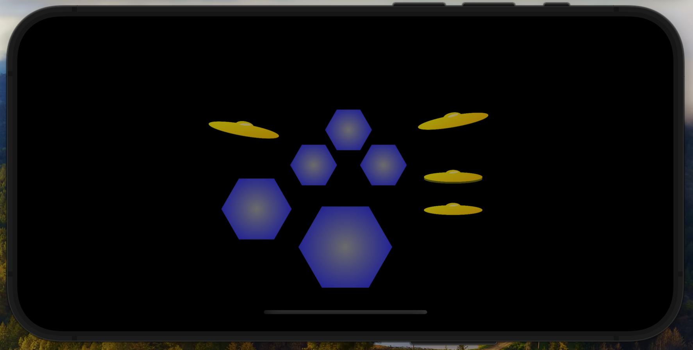

Here is a simple drum machine app using the AVFoundation MIDI function. The UI is very basic.

[Watch a sample video](

https://github.com/user-attachments/assets/696002f5-d8fe-4ad9-86bd-0d83c105e4c9

)

Changes from previous version:

* removed dependance on Momu library given its age and using Apple midi functions and soundfont
* changed graphics
* added cymbals supported by soundfont

